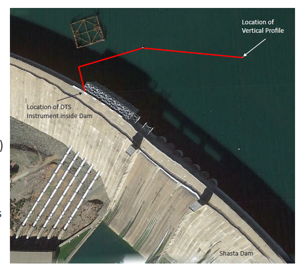
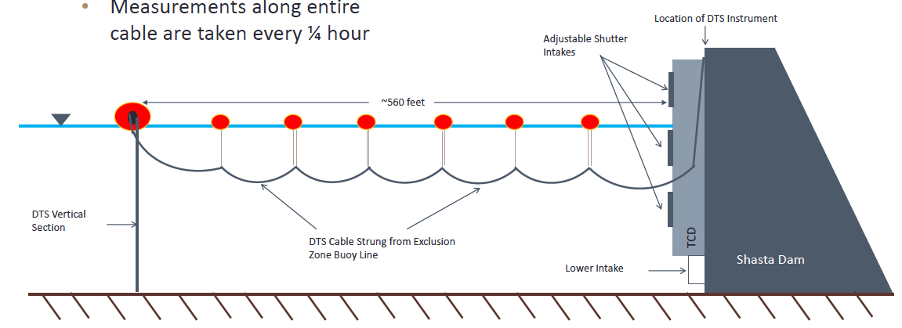
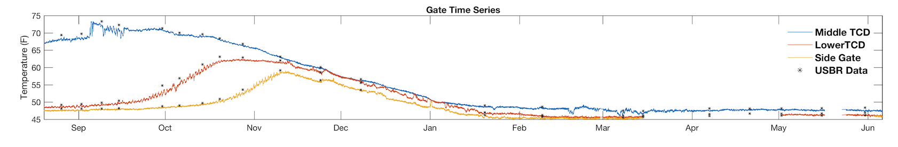
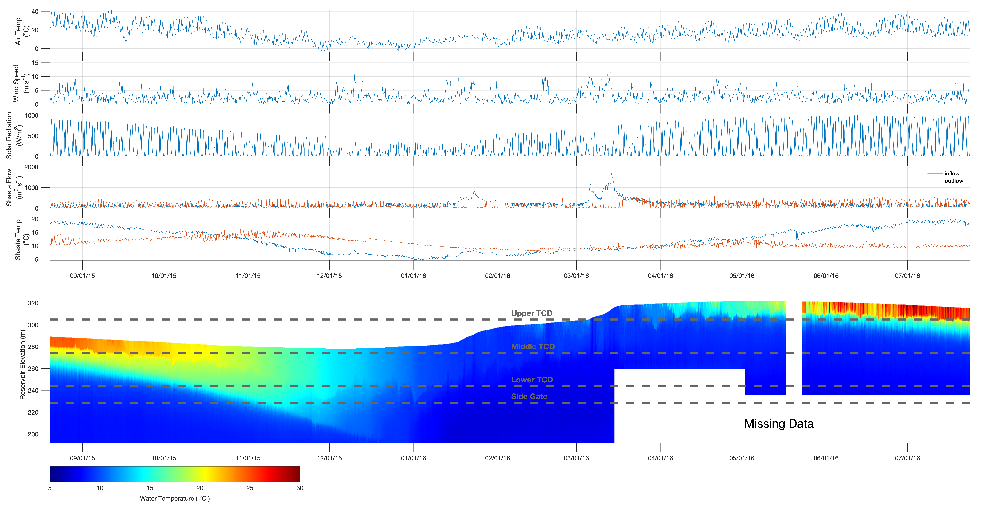

# shasta-dts-2015-and-2016

Summary of distributed temperature sensing (DTS) data from Shasta Reservoir, CA

Last updated 11/20/2024, Miles Daniels (miles.daniels@ucsc.edu)

### Methods: 

The goal of the project was to better understand how metrological forcings and operations of Shasta Dam effect the thermal dynamics of the Shasta Reservoir, which is the main source of cold water used for downstream temperature management on the Sacramento River. To do so, distributed temperature sensing (DTS) technology was deployed in Shasta Reservoir near the face of the temperature control device (TCD) from August 2015 to July 2016. The DTS instrument was housed in Shasta Dam with the fiber optic cable strung from exclusion buoys out to ~170 meters from the face of the dam and then dropped vertically ~ 100 meters before being returned to the DTS instrument. 
Figures 1 and 2 provide a plan and side profile view of the deployment setup. Figures were sources from a poster presented by Rachel Hallnan at the California Water Environmental Modeling Forum in 20216.

---

Figure 1: Plan view of DTS installation at Shasta Reservoir.

---

Figure 2: Side view of DTS installation at Shasta Reservoir.

---

DTS data were calibrated as outlined in Huasner et al. 2011 using calibration baths located next to the DTS instrument. Figure 3 provides a comparison of DTS temperatures and temperature collected during USBR’s routine vertical profiles for elevations near the middle, lower, and side gate of the TCD.

---

Figure 3: Comparison of DTS temperature and USBR vertical profile temperatures at three elevations.

---

In addition to DTS data, meteorological and hydrological data were collected from various sources to better understand factors affecting the thermal dynamics of the reservoir (Table 1). Specifically, meteorological data were sourced from the North American Region Reanalysis (NARR; https://psl.noaa.gov/data/gridded/data.narr.html) while hydrological data (flow and temperature) were sourced from the California Data Exchange Center (CDEC; https://cdec.water.ca.gov/). Methods of gap filling and bias correction for these data sets are further outlined in Daniels et al. 2018.

_Table1: Meteorology and hydrology variables gathered._
| Variable  | Units| Source|
|  :---:  |  :---: | :---: |
| air Temperature at 2m| degree Celsius | NARR |
| dew Point Temperature at 2m | degree Celsius | NARR |
| wind speed at 10m | meters per second | NARR |
| wind direction calculated from U and V wind at 10m| radians | NARR |
| cloud cover| 0-10 (0 = no clouds, 10 = full coverage) | NARR |
| downward solar radiation| Watts per square meter| NARR |
| downward solar radiation| Watts per square meter| NARR |
| pit river flow | cubic meters per second| CDEC; gauge PMN |
| pit river temperature | degree Celsius | CDEC; gauge PMN |
| mccloud river flow | cubic meters per second| CDEC; gauge MSS |
| mccloud river temperature | degree Celsius | CDEC; gauge MSS |
| sacramento river flow | cubic meters per second| CDEC; gauge DLT |
| sacramento river temperature | degree Celsius | CDEC; gauge DLT |
| shasta dam flow | cubic meters per second| CDEC; gauge SHD |
| shasta dam temperature | degree Celsius | CDEC; gauge SHD |

### Results:

Below (Figure 4)is a graphical summary of results from the DTS and the meteorological and hydrological variables. The plot below shows a time series of primary meterorological forcings (air temperature, wind speed, and solar radiation in additions to primary hydrologocal conditions (total Shasta inflow and outlfow volume and flow weighted inflow temperauture and Shasta release temperature). Below the time sereis plots is a representation of the DTS data shown as a vertical profile over time, with reservoir elevation on the Y-axis and time on the X-axis with temperature represented by color. Note that the mean elevations of the TCD gates are also plotted and any white space below the water line is data that was missing due to power outage at the DTS intrument and or cable entanglement. 

---

Figure 4: Summary of meteorology, hydrology, and DTS data.

---
### Data: 

All data described here is available on this GitHub page. Specifically, the file "shasta_dts_hydro_met_data.mat" is a grouping of matlab structures and time tables. The matlab structure is used to hold the DTS data in "dts_data" and the time tables are used to hold the meteorological variables in "meteorology_data" and the hydrological variables in "reservoir_flow_temp_data". Each data type has the associated metadata included, but please reach out to miles.daniels@ucsc.edu or eric.danner@noaa.gov for questions. 

### Acknowledgments:

Installation and data curation of the DTS data involved many individuals including: Eric Danner, Scott Tyler, Laurel Saito, Rachel Hallnan, Andrew Pike, Miles Daniels and others including logistical support from USBR.

### References:

Daniels, Miles E., Vamsi K. Sridharan, Sara N. John, and Eric M. Danner. 2018. Calibration and validation of linked water temperature models for the Shasta Reservoir and the Sacramento River from 2000 to 2015. NOAA Technical Memorandum NMFS-SWFSC-597.

Hausner, M.B., F. Suárez, K.E. Glander, N. van de Giesen, J.S. Selker, and S.W. Tyler. 2011. Calibrating single-ended fiber-optic Raman spectra distributed temperature sensing data. Sensors 11 (11):10859–10879.

